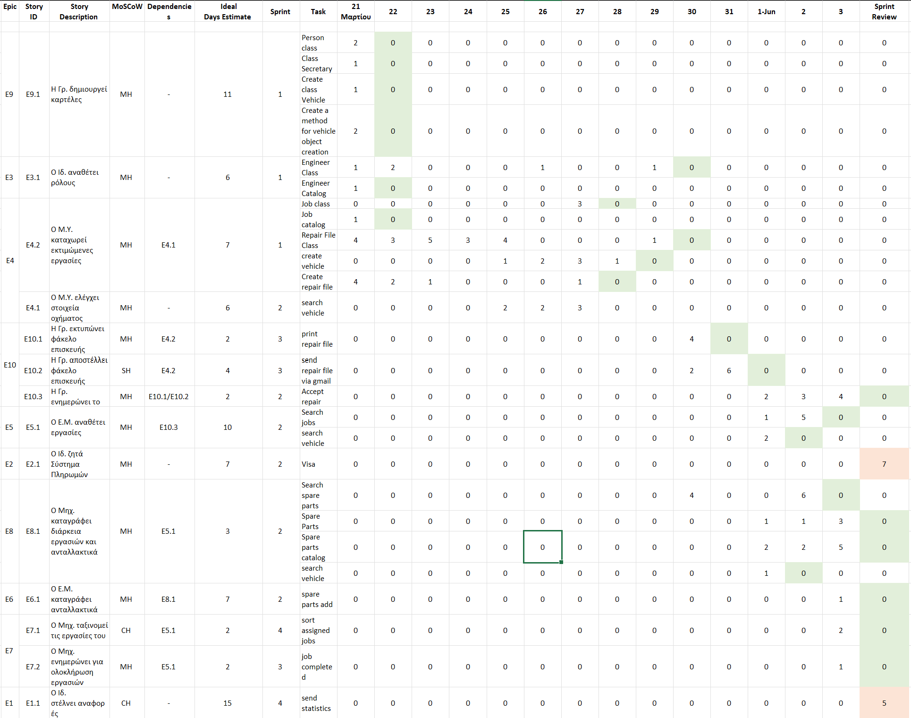
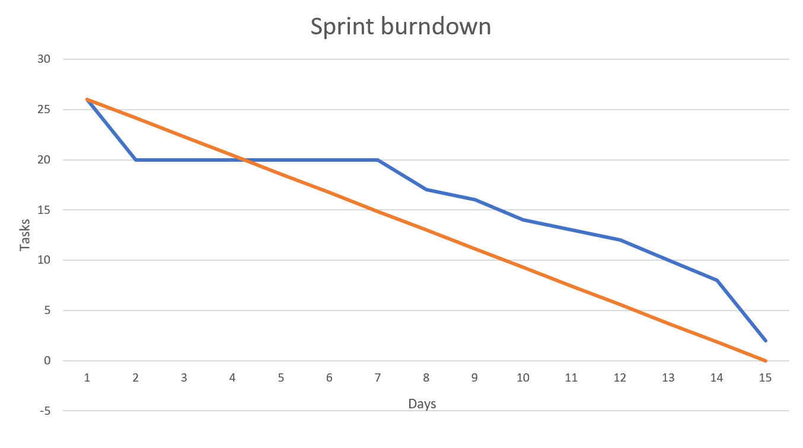

# CarOps Information System

 
 

<table>
  <caption>Ομάδα 28</caption>
    <tr>
        <th>Τζήκα</th>
        <th>Τσολακίδης</th>
        <th>Φουλίδης</th>
        <th>Χαϊντάρι</th>
        <th>Χαμαλίδης</th>
    </tr>
    <tr>
        <td>Δήμητρα</td>
        <td>Βασίλειος</td>
        <td>Δημήτριος</td>
        <td>Εριόλα</td>
        <td>Σ. Βασίλειος</td>
    </tr>
    <tr>
        <td colspan="5">Πανεπιστήμιο Μακεδονίας</td>
    </tr>
    <tr colspan="5">
        <td colspan="5">Τμήμα Εφαρμοσμένης Πληροφορικής</td>
    </tr>
</table>
<br>

# Instructions

Here, we first give instruction about where to download IntelliJ and JavaFX. After that, we give steps and explain how to use the information system CarOps from the command line. Also, from the user interface.

## Jetbrains IntelliJ IDEA Setup

You can install IntelliJ IDEA from [here](https://www.jetbrains.com/idea/). If you have an academic email you can download it for free but if you don’t, you can choose the option trial.

This project also includes JavaFx library in order to implement graphical interfaces. IntelliJ IDEA recognizing this and downloads the library automatically. If this don’t happen, you may want to install it manually from [here](https://openjfx.io/).

## Using CarOps from the command line

When you successfully run CarOps, you will be introduced to his command line interface. First of all, CarOps asks you choose a role from the main information system's user. You can choose:

 - Owner - 1
 - Secretary - 2
 - Reception Engineer - 3
 - Supervisor Engineer - 4
 - Engineer - 5
 - Exit / Run GUI - 0

In case you type the option Exit / Run GUI (0), the program will terminate his command line and will open a logon window. To simplify things, let us choose from the order as is, top-down.

**Case 1:** To logon as owner you don't need a username, you have the ability to change the roles from the engineers. Talking about roles, you can change each engineer's roles individually, there are 3 roles and an engineer can have only one of them 1) **Simple engineer** executes his jobs 2) **Reception** has the ability to create a new vehicle card, he also writes to the system, the jobs that may need for the repair and last 3) **Supervisor** engineer assigns the possible jobs to each other engineer. Continuing, typing 1 to the command line will show a list of all available engineers in the system. You type the number _n_ to choose an engineer. As we said, there are 3 only options.

**Case 2:** Secretary role. To login, you need to enter a username `Ταμπούρης` or `Φουλίδης`. As secretary you can create an new appointment (also modify it), vehicle and customer. You can also print the repairfiles and read appoindments.

# Print output sample

## Catalog print data 

  ```
Total Catalog contents:

> All Jobs in catalog:
n Name                        Price     
1 |Oil change                 |20 €
2 |Cabin filter change        |5  €
3 |Brake maintenance          |30 €

> All Spare Parts in catalog:
n Name                       |A-Q  Price per unit
1 |Oil package 4lt           |34   |30 €
2 |Oil filter                |55   |20 €
3 |Cabin filter              |90   |30 €
4 |Front wheel brake pad     |44   |5  €
5 |Back wheel brake pad      |22   |5  €
6 |Break oil                 |37   |10 €

> All Repair Files in catalog:
n Repair duration in days    Status      Plate number   Type        Est. Jobs  Assigned Jobs  Total Cost
1 |1                         |Awaiting   |KTR4456       |Truck      |3        |2              |105 €
2 |2                         |Awaiting   |NIK3745       |Vehicle    |0        |1              |80  €

> All Appointments in catalog:
n Date                       Name             Surname         Phone number          Vehicle Plate         Brand                 Τype                
1 |13/13/1222 - 12:20        |No customer     | -             | -                   |No vehicle           | -                   | -                  
2 |16/7/2024 - 15:00         |Μαρία           |Κάλλας         |6996986610           |KTR4456              |TOYOTA               |Truck               
3 |16/7/2024 - 16:00         |Γιάννης         |Πάριος         |1234567893           |NIK3745              |Land                 |Vehicle             

> All Customers in catalog:
n ID        Name             Surname          Phone Number    Email                 Address             
1 |CUS1     |Τάσος           |Λειβαδίτης      |1234567890     |tasos@gmail.com      |t12345              
2 |CUS2     |Μαρία           |Κάλλας          |6996986610     |kallas@gmail.com     |t12346              
3 |CUS3     |Γιάννης         |Πάριος          |1234567893     |parios@gmail.com     |t12347              
4 |CUS4     |Μέρη            |Παρμεζάνα       |1234567894     |parmezana@gmail.com  |t12348              
5 |CUS5     |Τάκης           |Τσουκαλάς       |1234567895     |tsoukalas@gmail.com  |t12349              

> All Vehicles in catalog:
n Plate Number   Brand     Model                      ProdYear    Vehicle Type   Other Data
1 |KTR4456       |TOYOTA   |90Turbo                   |1989       |Truck       ~ Capacity : 500.0
2 |NIK3745       |Land     |LandRover Range Rover HSE |2014       |Vehicle    

> All Engineers in catalog:
n ID        Name             Surname          Role      
1 |MHX1     |Κωνσταντίνος    |Βεργίδης        |reception 
2 |MHX2     |Δήμητρα         |Τζήκα           |supervisor
3 |MHX3     |Βασίλης         |Τσολακίδης      |engineer  
4 |MHX4     |Εριόλα          |Χαϊντάρη        |engineer  
5 |MHX5     |Βασίλης         |Χαμαλίδης       |engineer 
  ```
  
# Scrum

## Sprint backlog  



## Sprint burndown chart  




<hr>
<p align="center"> <i> Η παρούσα εργασία υλοποιήθηκε στα πλαίσια του μαθήματος 
<br>
<b> Ανάλυση & Σχεδίαση Συστημάτων </b> 
<br>
4ου εξαμήνου </i> </p> 

<p align="center"> Θεσσαλονίκη 2023  </p> 


# license: 


<p> CarOps is available as open source under the terms of <a href="https://github.com/bill-chamal/Car-service-IS/blob/db37606a14da6933994ade9e4c618c37b5444c1f/LICENSE">The MIT License (MIT)</a></p>

<p>Copyright © 2023 <a href="https://github.com/CarOps-28">CarOps-28</a>.</p>

<p>Permission is hereby granted, free of charge, to any person obtaining a copy of this software and associated documentation files (the “Software”), to deal in the Software without restriction, including without limitation the rights to use, copy, modify, merge, publish, distribute, sublicense, and/or sell copies of the Software, and to permit persons to whom the Software is furnished to do so, subject to the following conditions:</p>

<p>The above copyright notice and this permission notice shall be included in all copies or substantial portions of the Software.</p>

<p>THE SOFTWARE IS PROVIDED “AS IS”, WITHOUT WARRANTY OF ANY KIND, EXPRESS OR IMPLIED, INCLUDING BUT NOT LIMITED TO THE WARRANTIES OF MERCHANTABILITY, FITNESS FOR A PARTICULAR PURPOSE AND NONINFRINGEMENT. IN NO EVENT SHALL THE AUTHORS OR COPYRIGHT HOLDERS BE LIABLE FOR ANY CLAIM, DAMAGES OR OTHER LIABILITY, WHETHER IN AN ACTION OF CONTRACT, TORT OR OTHERWISE, ARISING FROM, OUT OF OR IN CONNECTION WITH THE SOFTWARE OR THE USE OR OTHER DEALINGS IN THE SOFTWARE.</p>

