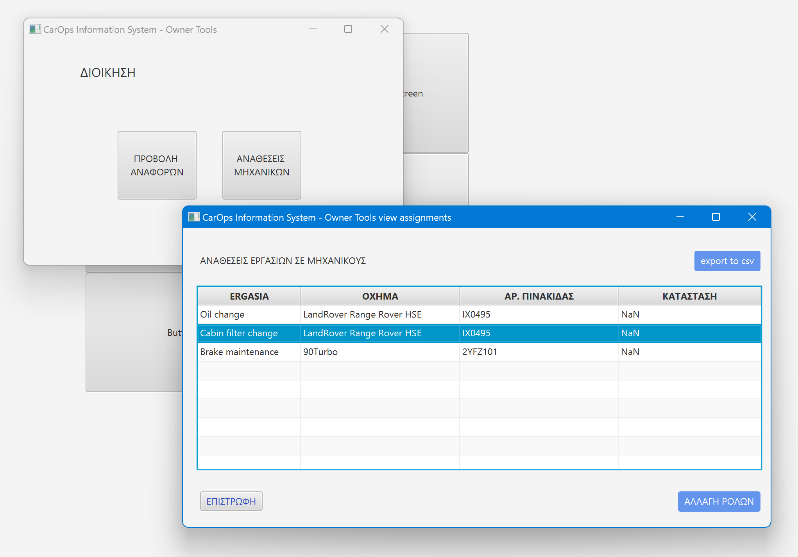

<h1> CarOps </h1>


 
 

<table>
  <caption>Ομάδα 28</caption>
    <tr>
        <th>Τζήκα</th>
        <th>Τσολακίδης</th>
        <th>Φουλίδης</th>
        <th>Χαϊντάρι</th>
        <th>Χαμαλίδης</th>
    </tr>
    <tr>
        <td>Δήμητρα</td>
        <td>Βασίλειος</td>
        <td>Δημήτριος</td>
        <td>Εριόλα</td>
        <td>Σ. Βασίλειος</td>
    </tr>
    <tr>
        <td colspan="5">Πανεπιστήμιο Μακεδονίας</td>
    </tr>
    <tr colspan="5">
        <td colspan="5">Τμήμα Εφαρμοσμένης Πληροφορικής</td>
    </tr>
</table>

<p>
Το CarOps είναι ένα συνεργείο οχημάτων με μεγάλη αύξηση εργαζομένων και κύκλουεργασιών. Το CarOps σε ως συνήθως, δέχεται αδιαχείριστα μεγάλο πλήθος πελατών σε συγκεκριμένες ώρες ως αποτέλεσμα, να συνωστίζονται και να μην διατηρείται ουρά προτεραιότητας. 
</p>
<p>
Για πρώτη φορά, η διεύθυνση του CarOps ήρθε με επικοινωνία μαζί. Κύριο θέμα τους ήταν, η ανάπτυξη ενός πληροφοριακού συστήματος που θα βοηθούσε το ίδιο το συνεργείο να διαχειρίζεται τους πελάτες και τα οχήματα με πιο αποτελεσματικό τρόπο. Η διεύθυνση φαίνεται να έχει πειστεί αρκετά απ’ ότι ακούγεται στην πιάτσα για τις επιπτώσεις πληροφοριακών συστημάτων σε μία επιχείρηση. Συγκεκριμένα, ήταν αποφασισμένοι να αναθέσουν στα χέρια μας την ανάπτυξη αυτού του συστήματος αλλά ήταν λίγο επίφοβοι καθώς, ήταν οι πρώτοι πελάτες μας και δε είχαμε άλλη εμπειρία αλλά μόνο στην Java. Για αυτόν τον λόγο, προτίμησαν να μας δώσουν οδηγίες και να εστιάσουμε σε συγκεκριμένα προβλήματα και να μην ανασχεδιάσουμε ολόκληρη την επιχείρησή τους.
</p>
<p>
Την επόμενη μέρα στρωθήκαμε στην δουλειά, αποφασίσαμε πρώτα απ’ όλα έπρεπε να προετοιμαστούμε καθώς είχαμε υπολογίσουμε και να αναλογιστούμε πολλά θέματα όπως τα οικονομικά, σκοπιμότητας, τις ανάγκες τις επιχείρησης και τα θέματα που μπορεί να καλύψει ένα πληροφοριακό σύστημα. Έχοντας αποτυπώσει όλα αυτά, σε δύο μόνο σελίδες χαρτί, το στείλαμε στην διεύθυνση του CarOps περιμένοντας την έγκριση τους. </p>
<p>
Πέρασαν μέρες ανυπομονησίας και τελικά λάβαμε την πρώτη έγκρισή για την ανάπτυξη του πληροφοριακού συστήματος της CarOps. Έχοντας διαθέσιμα όλα τα πράγματα που μπορεί να χρειαστούμε ξεκινήσαμε τις φάσεις ανάλυση, σχεδίαση και τέλος την υλοποίηση του συστήματος.
</p>
<p>
Για την υλοποίηση του σε κώδικα, αποφασίσαμε να το δημοσιεύσουμε στο GitHub για να διευκολυνθεί η ομάδα. Ήταν η πρώτη μας ανάπτυξη ενός πλήρους πληροφοριακού συστήματος και είμαστε πλήρως ευχαριστημένοι από τα αποτελέσματα και την λειτουργικότητα του. Ανυπομονούμε να το εγκαταστήσουμε στην επιχείρηση και να ικανοποιήσει όλες τις απαιτήσεις της διεύθυνσης.
</p>

<h2>Εξαγωγή δεδομένων από την μέθοδο printData():</h2>

```
> All Jobs in Catalog:
n Name                       Price     
1|Oil change                 |20 €
2|Cabin filter change        |5  €
3|Brake maintenance          |30 €

> All Spare part:
n Name                       Price per unit
1|Oil package 4lt            |30 €
2|Oil filter                 |20 €
3|Cabin filter               |30 €
4|Front wheel brake pad      |5  €
5|Back wheel brake pad       |5  €
6|Break oil                  |10 €

> All Repair File:
n Repair duration in days    Total Cost
1|1                          |105 €
2|2                          |80  €
```

<details>
  <summary>
    <h2>Objected created successful message</h2>
  </summary>
  
```
Ylopoiisi ton zitimaton toy paradotaioy
New Secretary Tampouris has been created

New Secretary Mantas has been created

New Customer Tzhka has been created

New Customer Tsolakidis has been created

New Customer Foulidis has been created

New Customer Hajdari has been created

New Customer Xamalidis has been created

New Vehicle KTR4456 has been created

New ReceptionEngineer Vergidis has been created

New Vehicle NIK3745 has been created

New Job 'Oil change' has been created

New Job 'Cabin filter change' has been created

New Job 'Brake maintenance' has been created

New SparePart 'Oil package 4lt' has been created

New SparePart 'Oil filter' has been created

New SparePart 'Cabin filter' has been created

New SparePart 'Front wheel brake pad' has been created

New SparePart 'Back wheel brake pad' has been created

New SparePart 'Break oil' has been created

New Appointment with customer: CUS2 has been created

New Appointment with customer: CUS2 has been created

New Repairfile with vehicle: KTR4456 has been created

New Repairfile with vehicle KTR4456 has been created

New supervisorEngineer Lee has been created

New Engineer Caephile has been created

New Engineer Cruise has been created

New Assignment in engineer: Martha has been created

New Assignment in engineer: Tom has been created

New Assignment in engineer: Martha has been created
```

</details>

<details>
  <summary>
     <h2>Printers output</h2>
  </summary>
  
  ```
  Total Catalog contents:
> All Repair Files in catalog:
n Repair duration in days    Status      Plate number   Type        Est Jobs  Assign J  Total Cost
1 |1                         | -         |KTR4456       |Truck      |3        |2        |105 €
2 |2                         | -         |NIK3745       |Car        |3        |1        |80  €

> All Appointments in catalog:
n Date                       Name             Surname         Phone number          Vehicle Plate         Brand                 type                
1 |16/7/2024 - 15:00         |Vasileios       |Tsolakidis     |6996986610           |KTR4456              |TOYOTA               |Truck               
2 |16/7/2024 - 16:00         |Dimitris        |Foulidis       |1234567893           |KTR4456              |TOYOTA               |Truck               

> All Customer data in catalog:
n ID        Name             Surname          Phone Number    Email                 Address             
1 |CUS1     |Dimitra         |Tzhka           |1234567890     |tzhka@gmail.com      |t12345              
2 |CUS2     |Vasileios       |Tsolakidis      |6996986610     |bill@gmail.com       |t12346              
3 |CUS3     |Dimitris        |Foulidis        |1234567893     |jimmy@gmail.com      |t12347              
4 |CUS4     |Erjola          |Hajdari         |1234567894     |eri@gmail.com        |t12348              
5 |CUS5     |Vasileios       |Xamalidis       |1234567895     |bill2@gmail.com      |t12349              

> All Vehicles in catalog:
n Plate Number   Brand     Model                      ProdYear    Vehicle Type   Other Data
1 |KTR4456       |TOYOTA   |90Turbo                   |1989       |Truck       ~ Capacity : 500.0
2 |NIK3745       |Land     |LandRover Range Rover HSE |2014       |Car        

> All data Engineers in catalog:
n ID        Name             Surname          Role      
1 |MHX1     |Konstantinos    |Vergidis        |reception 
2 |MHX2     |Bruce           |Lee             |supervisor
3 |MHX3     |Martha          |Caephile        |engineer  
4 |MHX4     |Tom             |Cruise          |engineer  
  ```
  
</details>

<h2>HCI with JavaFX:</h2>



<hr>
<p align="center"> <i> Η παρούσα εργασία υλοποιήθηκε στα πλαίσια του μαθήματος 
<br>
<b> Ανάλυση & Σχεδίαση Συστημάτων </b> 
<br>
4ου εξαμήνου </i> </p> 

<p align="center"> Θεσσαλονίκη 2023  </p> 

<h2>license:</h2>
<hr>


<p> CarOps is available as open source under the terms of <a href="https://github.com/bill-chamal/Car-service-IS/blob/db37606a14da6933994ade9e4c618c37b5444c1f/LICENSE">The MIT License (MIT)</a></p>

<p>Copyright © 2023 Bill Chamalidis et al.</p>

<p>Permission is hereby granted, free of charge, to any person obtaining a copy of this software and associated documentation files (the “Software”), to deal in the Software without restriction, including without limitation the rights to use, copy, modify, merge, publish, distribute, sublicense, and/or sell copies of the Software, and to permit persons to whom the Software is furnished to do so, subject to the following conditions:</p>

<p>The above copyright notice and this permission notice shall be included in all copies or substantial portions of the Software.</p>

<p>THE SOFTWARE IS PROVIDED “AS IS”, WITHOUT WARRANTY OF ANY KIND, EXPRESS OR IMPLIED, INCLUDING BUT NOT LIMITED TO THE WARRANTIES OF MERCHANTABILITY, FITNESS FOR A PARTICULAR PURPOSE AND NONINFRINGEMENT. IN NO EVENT SHALL THE AUTHORS OR COPYRIGHT HOLDERS BE LIABLE FOR ANY CLAIM, DAMAGES OR OTHER LIABILITY, WHETHER IN AN ACTION OF CONTRACT, TORT OR OTHERWISE, ARISING FROM, OUT OF OR IN CONNECTION WITH THE SOFTWARE OR THE USE OR OTHER DEALINGS IN THE SOFTWARE.</p>


