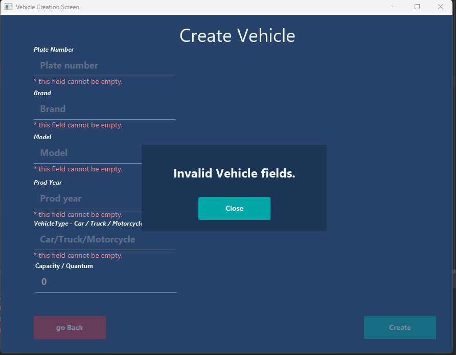
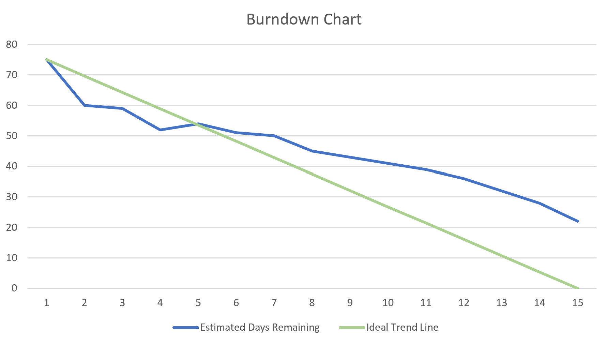

# CarOps 
_A full functional Information System_

 
 

<table>
  <caption>Ομάδα 28</caption>
    <tr>
        <th>Τζήκα</th>
        <th>Τσολακίδης</th>
        <th>Φουλίδης</th>
        <th>Χαϊντάρι</th>
        <th>Χαμαλίδης</th>
    </tr>
    <tr>
        <td>Δήμητρα</td>
        <td>Βασίλειος</td>
        <td>Δημήτριος</td>
        <td>Εριόλα</td>
        <td>Σωτήριος Βασίλειος</td>
    </tr>
    <tr>
        <td colspan="5">Πανεπιστήμιο Μακεδονίας - University of Macedonia</td>
    </tr>
    <tr colspan="5">
        <td colspan="5">Τμήμα Εφαρμοσμένης Πληροφορικής - Department of Applied Informatics</td>
    </tr>
</table>
<br>

## Jetbrains IntelliJ IDEA Setup

- You can install IntelliJ IDEA from [here](https://www.jetbrains.com/idea/). <br>
- This project also includes JavaFx library in order to implement graphical interfaces. IntelliJ IDEA recognizing this and downloads the library automatically. If this don’t happen, you may want to install it manually from [here](https://openjfx.io/).

## Documentation Κώδικα στο command line
Ο κώδικας υλοποιεί τα ζητούμενα του παραδοτέου και έπειτα εμφανίζει τα στοιχεία των καταλόγων. Είναι πλήρης και λειτουργεί σωστά ενώ περιέχει όλες τις λειτουργίες των λεκτικών περιγραφών και γραφική διασύνδεση για μέγιστη ευχρηστία. Μετά την εμφάνιση των καταλόγων, εμφανίζεται μια λίστα επιλογών σύνδεσης στο σύστημα για κάθε ιδιότητα χρήστη. Επιλέγοντας μεταξύ 1-5, γίνεται σύνδεση ως ιδιοκτήτης, γραμματεία, Μηχανικός Υποδοχής, Επιβλέποντας Μηχανικός ή απλός Μηχανικός αντίστοιχα.  Για τις επιλογές 2-5 για τις οποίες υπάρχουν πολλαπλοί χρήστες-λογαριασμοί στο σύστημα, απαιτείται η εισαγωγή του επιθέτου για σύνδεση. Οι λειτουργίες συμβαδίζουν με ακρίβεια με τις περιγραφές των διαδικασιών στο Case Study. Για παράδειγμα, δε μπορούν να γίνουν αναθέσεις εργασιών σε οχήματα για τα οποία ο ιδιοκτήτης τους δεν έχει δεχτεί ακόμα την επισκευή τους.

### Με σύνδεση ως ιδιοκτήτης (επιλογή 1) εμφανίζονται οι εξής επιλογές:
- <b> Επιλογή 1 - Αλλαγή ρόλων: </b> Εμφανίζει τη λίστα με τους μηχανικούς και το σύστημα ζητά από τον ιδιοκτήτη να επιλέξει έναν από αυτούς και να του αναθέσει τον ρόλο που επιθυμεί (1-Υποδοχής, 2-Επιβλέποντας, 3-Υποδοχής).
- <b> Επιλογή 0 - Έξοδος: </b>  Εμφάνιση αρχικής οθόνης επιλογής χρήστη.

### Με σύνδεση ως γραμματεία (επιλογή 2) εμφανίζονται οι εξής επιλογές:
- <b> Επιλογή 1 - Δημιουργία ραντεβού:</b> Η γραμματεία μπορεί να δημιουργήσει ραντεβού χωρίς καρτέλα πελάτη ή/και χωρίς καρτέλα οχήματος επιλέγοντας μεταξύ των 1,2 και 3. Με την επιλογή 0 γίνεται επιστροφή στο αρχικό μενού γραμματείας.
- <b> Επιλογή 2 - Δημιουργία καρτέλας οχήματος:</b> Η γραμματεία μπορεί να δημιουργήσει μια καρτέλα οχήματος συμπληρώνοντας τα απαιτούμενα στοιχεία. Το σύστημα πραγματοποιεί έλεγχο για να διασφαλιστεί ότι το όχημα δεν είναι ήδη καταχωρημένο με βάση τον αριθμό πινακίδας που δίνεται.
- <b> Επιλογή 3 - Δημιουργία καρτέλας πελάτη:</b> Η γραμματεία μπορεί να δημιουργήσει μια καρτέλα πελάτη συμπληρώνοντας τα απαιτούμενα στοιχεία. Το σύστημα πραγματοποιεί έλεγχο για να διασφαλιστεί ότι ο πελάτης δεν είναι ήδη καταχωρημένος με βάση τον αριθμό τηλεφώνου που δίνεται.
- <b> Επιλογή 4 - Αλλαγή κατάστασης φακέλου επισκευής βάσει απόφασης του πελάτη:</b> Το σύστημα επιτρέπει την αλλαγή κατάσταση μόνο για φακέλους για τους οποίους αναμένεται απάντηση από τον πελάτη (“Awaiting”). Εμφανίζεται η λίστα των φακέλων επισκευής και ζητείται από τη γραμματεία να καταχωρήσει τον αριθμό πινακίδας του οχήματος του φακέλου επισκευής για τον οποίο επιθυμείται αλλαγή κατάστασης. Η γραμματεία επιλέγει μεταξύ των καταστάσεων 1 (“Accepted”) ή 0 (“Declined”) ανάλογα την απάντηση του πελάτη.
- <b> Επιλογή 5 - Εκτύπωση φακέλου επισκευής:</b> Το σύστημα ζητά τον αριθμό πινακίδας του οχήματος του φακέλου επισκευής για τον οποίο επιθυμείται εμφάνιση των δεδομένων του και τα εκτυπώνει.
- <b> Επιλογή 6 - Εκτύπωση λίστας ραντεβού:</b> Γίνεται εμφάνιση των δεδομένων όλων των ραντεβού.
- <b> Επιλογή 7 - Ενημέρωση στοιχείων ραντεβού:</b> Εμφανίζονται μόνο τα ραντεβού που δεν έχουν καρτέλα πελάτη ή/και καρτέλα οχήματος. Η γραμματεία στη συνέχεια επιλέγει το είδος καρτέλας που θέλει να προσθέσει και την αναζητά ή τη δημιουργεί συμπληρώνοντας τα ζητούμενα στοιχεία.
- <b> Επιλογή 0 - Έξοδος:</b> Εμφάνιση αρχικής οθόνης επιλογής χρήστη.

### Με σύνδεση ως Μηχανικός Υποδοχής (επιλογή 3) εμφανίζονται οι εξής επιλογές:
- <b> Επιλογή 1 - Δημιουργία Φακέλου Επισκευής:</b> Πατώντας το 1, ο Μηχανικός Υποδοχής μπορεί να αναζητήσει το όχημα με βάση τον αριθμό πινακίδας. <br> - Στην περίπτωση όπου το όχημα δεν είναι καταχωρημένο, ο Μηχανικός Υποδοχής μπορεί να αναζητήσει ένα καινούριο (επιλογή 1)  ή να δημιουργήσει ένα νέο (επιλογή 2). <br> - Στην περίπτωση που το όχημα βρεθεί, εμφανίζεται η λίστα με τις διαθέσιμες εργασίες του συνεργείου. <br> Μόλις ο Μηχανικός Υποδοχής καταχωρίσει τις εργασίες που επιθυμεί, επιλέγει 0 και το σύστημα ζητά τις εκτιμώμενες ώρες επισκευής.
- <b> Επιλογή 0:</b> Έξοδος και επιστροφή στην αρχική λίστα επιλογής χρήστη.

### Με σύνδεση ως Επιβλέποντας Μηχανικός (επιλογή 4) εμφανίζονται οι εξής επιλογές:
- <b>  Επιλογή 1 - Δημιουργία ανάθεσης εργασιών:</b> Ο Επιβλέποντας Μηχανικός μπορεί να αναζητήσει όχημα προς επισκευή, επιλέγοντας το 1 και δίνοντας τον αριθμό πινακίδας του οχήματος. Το σύστημα επιτρέπει αναθέσεις μόνο για οχήματα των οποίων η επισκευή έχει γίνει δεκτή από τον πελάτη (κατάσταση Φακέλου Επισκευής ”Accepted”). <br> - Στην περίπτωση όπου η επισκευή είναι δεκτή από τον πελάτη, ο Επιβλέποντας Μηχανικός έχει την επιλογή ανάθεσης εργασίας σε μηχανικό (1), την επιλογή προσθήκης νέας εργασίας στο Φάκελο επισκευής (2) ή έξοδο (0) για επιστροφή στην αρχική λίστα επιλογών του Επιβλέποντα Μηχανικού.
- <b> Επιλογή 2 - Αλλαγή κατάστασης Φακέλου Επισκευής:</b> Ο Επιβλέποντας Μηχανικός αναζητά το σχετικό όχημα επιλέγοντας 1 και δίνοντας τον αριθμό πινακίδας του. Εάν όλες οι εργασίες του οχήματος έχουν ολοκληρωθεί, η κατάσταση του Φακέλου Επισκευής ενημερώνεται σε ολοκληρωμένη (“Completed”).
- <b> Επιλογή 0:</b> Έξοδος και επιστροφή στην αρχική λίστα επιλογής χρήστη.


### Με σύνδεση ως απλός Μηχανικός (επιλογή 5) εμφανίζονται οι εξής επιλογές:
- <b> Επιλογή 1 - Εμφάνιση εργασιών:</b> Εμφανίζονται οι εργασίες του μηχανικού που δεν έχει ολοκληρώσει.
- <b> Επιλογή 2 - Προσθήκη ανταλλακτικών και διάρκειας επισκευής για ολοκλήρωση εργασίας:</b> Γίνεται εμφάνιση μιας λίστας στοιχείων οχημάτων με την εργασία επισκευής τους που ανατεθεί στον συγκεκριμένο μηχανικό. Ο μηχανικός επιλέγει την εργασία που ολοκλήρωσε και στη συνέχεια τον τύπο και το πλήθος των ανταλλακτικών που χρησιμοποίησε. Το σύστημα ζητά επίσης τη διάρκεια επισκευής. Ο μηχανικός μπορεί να ακυρώσει τη καταχώρηση των δεδομένων με την επιλογή 0.
- <b> Επιλογή 0: </b> Έξοδος και επιστροφή στην αρχική λίστα επιλογής χρήστη.

# Fully functional Graphical User Interface

## Σύνδεση ως ιδιοκτήτης: <br>
- 'owner' <br>
#### Ενέργειες: <br>
- Αλλαγή ρόλων
## Σύνδεση ως γραμματεία: <br>
- 'Ταμπούρης' / 'Φουλίδης'  <br>
#### Ενέργειες: <br>
-  Δημιουργία ραντεβού
-  Δημιουργία καρτέλας οχήματος
-  Δημιουργία καρτέλας πελάτη
-  Ενημέρωση στοιχείων ραντεβού
## Σύνδεση ως Μηχανικός Υποδοχής: <br>
- 'Βεργίδης'<br>
#### Ενέργειες: <br>
-  Δημιουργία Φακέλου Επισκευής
## Σύνδεση ως Επιβλέποντας Μηχανικός: <br>
- 'Τζήκα'<br>
#### Ενέργειες: <br>
-  Δημιουργία ανάθεσης εργασιών
## Σύνδεση ως απλός Μηχανικός: <br>
- 'Τσολακίδης' / 'Χαμαλίδης' / 'Χαϊντάρι' <br>
#### Ενέργειες: <br>
-  Εμφάνιση εργασιών
-  Προσθήκη ανταλλακτικών και διάρκειας επισκευής για ολοκλήρωση εργασίας
<br>



<br> and more ...

# Catalogs print data 

  ```
Total Catalog contents:

> All Jobs in catalog:
n Name                        Price     
1 |Oil change                 |20 €
2 |Cabin filter change        |5  €
3 |Brake maintenance          |30 €

> All Spare Parts in catalog:
n Name                       |A-Q  Price per unit
1 |Oil package 4lt           |34   |30 €
2 |Oil filter                |55   |20 €
3 |Cabin filter              |90   |30 €
4 |Front wheel brake pad     |44   |5  €
5 |Back wheel brake pad      |22   |5  €
6 |Break oil                 |37   |10 €

> All Repair Files in catalog:
n Repair duration in days    Status      Plate number   Type        Est. Jobs  Assigned Jobs  Total Cost
1 |1                         |Awaiting   |KTR4456       |Truck      |3        |2              |105 €
2 |2                         |Awaiting   |NIK3745       |Vehicle    |0        |1              |80  €

> All Appointments in catalog:
n Date                       Name             Surname         Phone number          Vehicle Plate         Brand                 Τype                
1 |13/13/1222 - 12:20        |No customer     | -             | -                   |No vehicle           | -                   | -                  
2 |16/7/2024 - 15:00         |Μαρία           |Κάλλας         |6996986610           |KTR4456              |TOYOTA               |Truck               
3 |16/7/2024 - 16:00         |Γιάννης         |Πάριος         |1234567893           |NIK3745              |Land                 |Vehicle             

> All Customers in catalog:
n ID        Name             Surname          Phone Number    Email                 Address             
1 |CUS1     |Τάσος           |Λειβαδίτης      |1234567890     |tasos@gmail.com      |t12345              
2 |CUS2     |Μαρία           |Κάλλας          |6996986610     |kallas@gmail.com     |t12346              
3 |CUS3     |Γιάννης         |Πάριος          |1234567893     |parios@gmail.com     |t12347              
4 |CUS4     |Μέρη            |Παρμεζάνα       |1234567894     |parmezana@gmail.com  |t12348              
5 |CUS5     |Τάκης           |Τσουκαλάς       |1234567895     |tsoukalas@gmail.com  |t12349              

> All Vehicles in catalog:
n Plate Number   Brand     Model                      ProdYear    Vehicle Type   Other Data
1 |KTR4456       |TOYOTA   |90Turbo                   |1989       |Truck       ~ Capacity : 500.0
2 |NIK3745       |Land     |LandRover Range Rover HSE |2014       |Vehicle    

> All Engineers in catalog:
n ID        Name             Surname          Role      
1 |MHX1     |Κωνσταντίνος    |Βεργίδης        |reception 
2 |MHX2     |Δήμητρα         |Τζήκα           |supervisor
3 |MHX3     |Βασίλης         |Τσολακίδης      |engineer  
4 |MHX4     |Εριόλα          |Χαϊντάρη        |engineer  
5 |MHX5     |Βασίλης         |Χαμαλίδης       |engineer 
  ```
  
# Scrum

## Sprint backlog  


## Sprint burndown chart  




<hr>
<p align="center"> <i> This work was done as part of the course
<br>
<b> Systems Analysis & Design </b> 
<br>
4th semester </i> </p> 

<p align="center"> Thessaloniki 2023  </p> 

<br>

# license: 

<p> CarOps is available as open source under the terms of <a href="https://github.com/bill-chamal/Car-service-IS/blob/db37606a14da6933994ade9e4c618c37b5444c1f/LICENSE">The MIT License (MIT)</a></p>

<p>Copyright © 2023 <a href="https://github.com/CarOps-28">CarOps-28</a>.</p>

